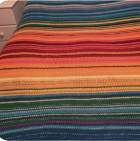

## Weather Blanket Big Data Project

### By Noa Lahan

The project aims to process historical weather data trends, specifically in terms of global warming and its effects on the world at large, hopefully raising awareness of the phenomenon's impact on everyone's lives ([WWF, 2016a]).

The data visualisation will be in the form of a digital "weather blanket" which should allow for easy trend or anomaly spotting in the data.
  
A weather blanket is a long-term project popular in crochet and knitting communities in which the crafter adds one new row to the blanket every day over the course of a year, alternating the color of the current row based on that day's temperature. The end result produces a full length blanket with a variety of colors that creates a visual way to see the year's temperature changes ([Bollanos, 2024]). Some examples (sourced from [Pinterest]):

Instead of a row representing a day and the blanket representing a year, in this project the data - and therefore the blanket - contains 80 years worth of weather information. Each column represents a year, going from 1940 on the left-most column to 2020 on the right. Each year will be seperated into its 365 days (366 for leap years), from January 1st on top to December 31st on the bottom of the page.

---

[Bollanos, 2024]: https://www.handylittleme.com/temperature-blanket-patterns/
[Pinterest]: https://www.pinterest.co.uk/search/pins/?q=weather%20blanket&rs=typed
[WWF, 2016a]: https://www.wwf.org.uk/climate-change-and-global-warming

#### Continued documentation in `main.ipynb`!

---

## Files

- `img` folder holds all visuals used in documentation
- `lib` folder holds all `.csv` files which contain the cleaned data for their respective country
- `index.html`: the visualisation website's HTML code - **Run to see the visualisation**
- `main.ipynb`: the data processing code and the project's documentation - **Read for project documentation**
- `script.js`: the visualisation website's JS code
- `style.css`: the visualisation website's CSS code
- `videoPresentation.mp4` is a quick video presentation of the project
  - also available [here](https://youtu.be/_AtRaT_nCmU?si=49ANaXzLthoJxRYU&t=2).